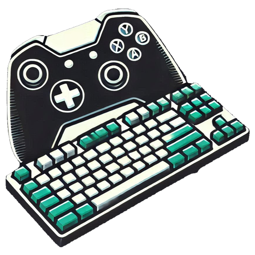
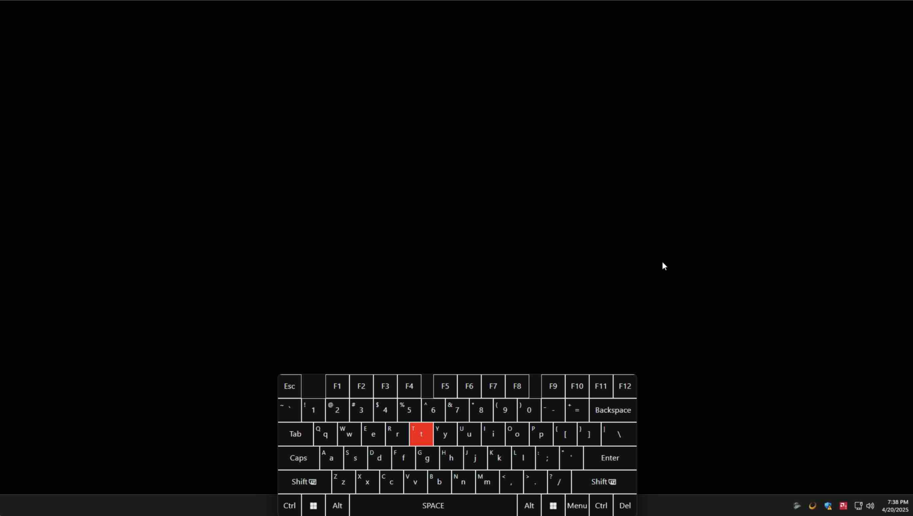
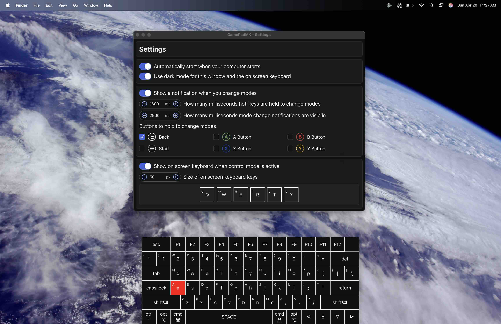

<h1 align="center">
  
  GamePadMK
  </br>
</h1>

<div align="center">


</div>

[](https://github.com/sponsors/jasecara)

[](https://www.gnu.org/licenses/gpl-3.0)


**GamePadMK** is a gamepad-controlled on-screen keyboard and mouse for Windows, macOS, and Linux. It can be used to easily control PCs connected to a TV or streamed remotely with [Sunshine](https://app.lizardbyte.dev/Sunshine/?lng=en-US). You can use it to navigate around applications and press hot keys like Ctrl+Alt+Del or Alt+Tab.

## How to Use

### GamePad / Controller Support

GamePadMK is compatible with most dual-stick gamepads/controllers, whether connected via wired or wireless. The following controllers have been tested and confirmed to work:

- Microsoft Xbox Wireless Controller (Bluetooth)
- 8Bitdo Ultimate Bluetooth Controller (Bluetooth)

### Installation

You can download the latest version of GamePadMK from the [Releases](https://github.com/jasecara/gamepadmk/releases/latest) page. Simply run the installer for your platform (.msi or .exe for Windows, .dmg for Mac) to get started.

You can also build the project yourself from source. See the [Building Locally](#building-locally) section for instructions.

### Default Controls

| Button                                                                                                                                                                                                                                                                                                                                                                                                   |                      | Result                           |
| -------------------------------------------------------------------------------------------------------------------------------------------------------------------------------------------------------------------------------------------------------------------------------------------------------------------------------------------------------------------------------------------------------- | -------------------- | -------------------------------- |
| <picture><source media="(prefers-color-scheme: dark)" srcset="./docs/icons/back_dark.svg" /></picture> + <picture><source media="(prefers-color-scheme: dark)" srcset="docs/icons/start_dark.svg" /></picture> | Back + Start         | Turn Control Mode On / Off       |
| <picture><source media="(prefers-color-scheme: dark)" srcset="./docs/icons/stick_right_dark.svg" /></picture>                                                                                                                                                                                      | Right Joystick       | Move Around Keyboard             |
| <picture><source media="(prefers-color-scheme: dark)" srcset="./docs/icons/stick_right_press_dark.svg" /></picture>                                                                                                                                                                    | Right Joystick Click | Show or Hide Keyboard            |
| <picture><source media="(prefers-color-scheme: dark)" srcset="./docs/icons/trigger_right_dark.svg" /></picture>                                                                                                                                                                             | Right Trigger        | Press or Release Key             |
| <picture><source media="(prefers-color-scheme: dark)" srcset="./docs/icons/bumper_right_dark.svg" /></picture>                                                                                                                                                                                | Right Button         | Toggle Long Press or Release Key |
| <picture><source media="(prefers-color-scheme: dark)" srcset="./docs/icons/trigger_left_dark.svg" /></picture>                                                                                                                                                                                | Left Trigger         | Press or Release Shift Key       |
| <picture><source media="(prefers-color-scheme: dark)" srcset="./docs/icons/dpad_up_dark.svg" /></picture>                                                                                                                                                                                                    | D-Pad Up             | Press Up Arrow Key               |
| <picture><source media="(prefers-color-scheme: dark)" srcset="./docs/icons/dpad_down_dark.svg" /></picture>                                                                                                                                                                                              | D-Pad Down           | Press Down Arrow Key             |
| <picture><source media="(prefers-color-scheme: dark)" srcset="./docs/icons/dpad_left_dark.svg" /></picture>                                                                                                                                                                                              | D-Pad Left           | Press Left Arrow Key             |
| <picture><source media="(prefers-color-scheme: dark)" srcset="./docs/icons/dpad_right_dark.svg" /></picture>                                                                                                                                                                                           | D-Pad Right          | Press Right Arrow Key            |
| <picture><source media="(prefers-color-scheme: dark)" srcset="./docs/icons/a_dark.svg" /></picture>                                                                                                                                                                                                                | A Button             | Left Click Mouse                 |
| <picture><source media="(prefers-color-scheme: dark)" srcset="./docs/icons/b_dark.svg" /></picture>                                                                                                                                                                                                                | B Button             | Right Click Mouse                |
| <picture><source media="(prefers-color-scheme: dark)" srcset="./docs/icons/stick_left_dark.svg" /></picture>                                                                                                                                                                                         | Left Joystick        | Move Mouse Pointer               |
| <picture><source media="(prefers-color-scheme: dark)" srcset="./docs/icons/stick_left_press_dark.svg" /></picture>                                                                                                                                                                       | Left Joystick Click  | Change Mouse Speed               |

### Settings

You can access the settings by clicking the GamePadMK icon in the taskbar or system tray.

- **Auto Start**: Enable or disable automatic startup with Windows.
- **Dark Mode**: Enable or disable dark mode for keyboard and settings window.
- **Show Notifications**: Enable or disable notification when the keyboard is shown or hidden.
- **Mode Change Buttons**: Choose the buttons used to toggle control mode on and off.
- **Show On-Screen Keyboard**: Show or hide the on-screen keyboard when control mode is active.
- **Key Size**: Adjust the size of the on-screen keyboard keys.

## Roadmap

### Planned Features

- **Keyboard Layout Import/Export**: Add functionality to import and export custom keyboard layouts.
- **Keyboard Layout Editor**: Create an editor for designing and modifying keyboard layouts.
- **Custom Themes**: Enable users to customize keyboard themes, including colors and styles.
- **Linux Support**: Add support for Linux keyboard layouts, testing, and provide binary releases.
- **Test Coverage**: Increase test coverage for the project to ensure reliability and stability for future features.
- **AutoSuggest**: Implement a feature to suggest words as the user types, enabling quick selection for autocomplete functionality.

## Building Locally

This project is built using Tauri and React. It also leverages `sdl2` bindings to handle input from connected gamepads. You can ensure `sdl2` is installed and available for Rust using [cargo-vcpkg](https://crates.io/crates/cargo-vcpkg):

```
cd src-tauri
cargo vcpkg build
cd ..
```

Next, install the required npm dependencies and start the Tauri development server:

```
npm install
npm run tauri dev
```

### Recommended Development Environment

- [VS Code](https://code.visualstudio.com/) with the following extensions:
  - [Tauri](https://marketplace.visualstudio.com/items?itemName=tauri-apps.tauri-vscode)
  - [rust-analyzer](https://marketplace.visualstudio.com/items?itemName=rust-lang.rust-analyzer)

## Feature Requests

Feature requests and contributions are always welcome! If you have ideas for new features or improvements, please open an issue or pull request on GitHub. When suggesting a specific feature, include as much detail as possible about its functionality and use case to help guide the discussion. If you find GamePadMK useful, consider starring it on GitHub to show your support and/or sponsoring the project!

## License

GamePadMK is an open-source and free software licensed under the [GPL-3.0](LICENSE.md).
(GNU General Public License v3.0).

## Acknowledgements

- [Tauri](https://tauri.app/) for its lightweight framework enabling seamless native app development.
- [Vite](https://vitejs.dev/) for its blazing-fast build and development tools.
- [Radix UI](https://www.radix-ui.com/) for its accessible and customizable UI components.
- [Rust](https://www.rust-lang.org/) for its unmatched performance and reliability.
- [rust-analyzer](https://marketplace.visualstudio.com/items?itemName=rust-lang.rust-analyzer) for enhancing the development experience.
- [SDL2](https://www.libsdl.org/) for robust gamepad input handling.
